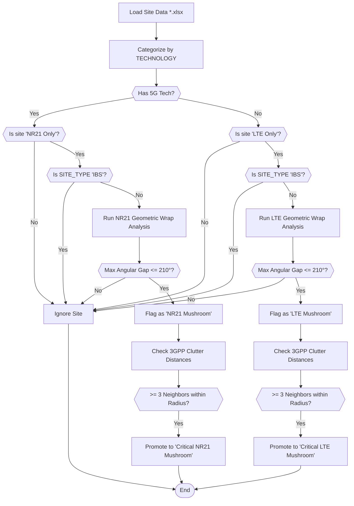

# Unified Network Spatial Analysis (LTE & NR)

## Description

This repository contains a Python-based advanced geospatial telemetry pipeline designed to analyze and stratify both legacy LTE and modern 5G network infrastructure. Using an innovative **Dual-Tier Categorization** algorithm, the system performs MapInfo Spatial Joins, physical 3GPP Clutter propagation mapping, and K-Nearest Neighbors (KNN) angular bearing calculations to accurately identify and prioritize isolated "Mushroom" cell sites that require immediate technology upgrades.

## Algorithm Logic & Rules

The analysis operates through a sophisticated, multi-stage spatial pipeline:

### 1. Dynamic Data Ingestion & Categorization
The algorithm dynamically loads network datasets via wildcard scanning (`*.xlsx`) and categorizes sites purely based on the `TECHNOLOGY`:
* **LTE Only:** Contains legacy `900`, `1800`, or `2100` without any 5G.
* **NR21 Only:** Contains `NR2100` (but no NR2600).
* **NR26 Only:** Contains `NR2600`, `NR26G`, or `NR26`.
* **NR21 & NR26:** Contains both.

### 2. MapInfo Clutter Spatial Join
To overcome missing or inaccurate spreadsheet data, the script loads raw MapInfo Vector Polygon files (`*.TAB`). It takes the GPS coordinates of every network site and performs a mathematical **Spatial Join (Point-in-Polygon)** overlay.
* This precisely assigns every single site its true `Morpho` classification (e.g., `DENSE URBAN`, `RURAL`, `SUB URBAN`).
* Any duplicate intersections caused by topographically overlapping sliver polygons are automatically dropped to maintain dataset integrity.

### 3. Dual-Tier Geometric & Coverage Analysis
The script evaluates every `NR21 Only` and `LTE Only` site against its surrounding upgraded infrastructure using a dual-tier algorithm:

**Tier 1: Geometric Surround Detection**
1. Finds the **20 Nearest Neighbors** and filters for upgraded sites (5G infrastructure for LTE sites, or NR26 for NR21 sites).
2. If there are at least 3 upgraded neighbors, it calculates the **Azimuth/Bearing Angles** to each one.
3. If the **Maximum Angular Gap** is `<= 210 degrees`, the site is officially flanked in a 360-degree manner and flagged as a **`Mushroom`**.

**Tier 2: 3GPP Continuous Coverage Enforcement**
1. To ensure that a Mushroom is actually covered by the surrounding infrastructure (and not sitting in a massive physical gap), it calculates the Haversine distance to those surrounding sites.
2. It enforces a strict **Maximum Distance Threshold (Radius)** based on the site's mathematically assigned clutter type:
   * **DENSE URBAN:** Max 500 meters
   * **URBAN:** Max 1,000 meters
   * **SUB URBAN:** Max 2,000 meters
   * **RURAL:** Max 5,000 meters
3. If the site still maintains at least 3 upgraded neighbors that meet BOTH the 210-degree geometric wrap AND the physical Clutter distance thresholds, it is promoted to **`Critical Mushroom`**.

### 4. Global Colocation Detection
For physical RF planning and interference tracking, the algorithm performs a global baseline pass over every single site in the network:
* It identifies the single closest physical neighbor to every site using the Haversine distance matrix.
* If a site is mathematically `<= 20 meters` from another site, it is globally flagged as **Colocated (<=20m)**.
* Colocated sites are visually highlighted with a glowing **Cyan Ring** on the Master Dashboard map, preventing them from being overlooked in dense urban clusters.

## Output Features
- **Unified Master Dashboard:** The script merges a high-performance Canvas Folium map, Chart.js KPI graphs, and an interactive Grid.js Data Table into a single, fully portable `.html` file. Non-actionable `LTE Only` sites are intentionally hidden from the physical map rendering to preserve system memory and ensure browser performance across the ~35,000 node network.
- **Export Capabilities:** The dashboard allows for one-click CSV exporting of the actionable Mushroom sites.

> **Note:** Base data, shapefiles, and MapInfo layers (`.xlsx`, `.shp`, `.TAB`) are explicitly ignored in this repository for privacy/security reasons.
